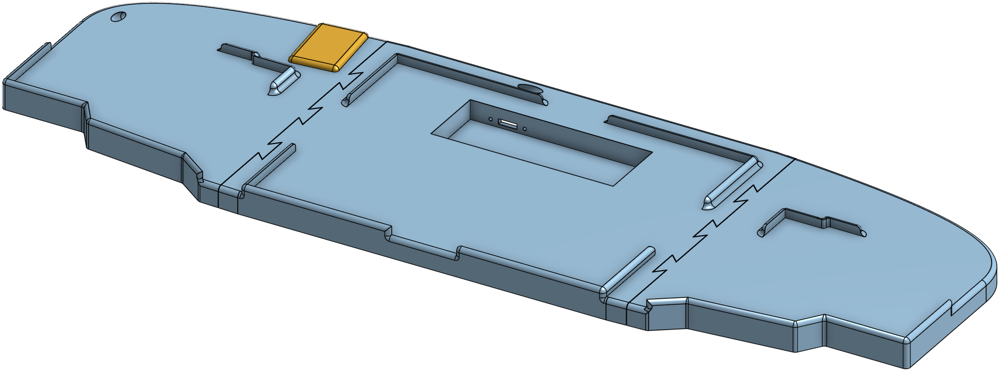

# 3W6-MagicTrackpad-Board
3D-printable board for accommodating a split-3W6-Keyboard with a MagicTrackpad in between the halves. It supports using a USB-hub with some "simplified" wiring to allow a single cable to go from the board to the computer.

[To the source](https://cad.onshape.com/documents/8cfc3af1c47815772d1f3507/w/c3f668211c18f6a1301e4a11/e/e9f86f193ed97f27738ab335?configuration=Hub_Cutout%3Dfalse&renderMode=0&uiState=6aae447b8d1004d99c00f125)

[To the exports](exports/)
